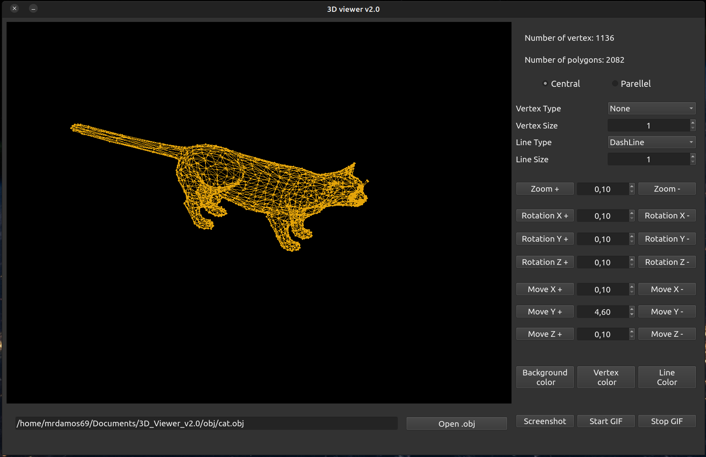

# 3DViewer v2.0

## Part 1. 3DViewer v2.0

Разработать программу для визуализации каркасной модели в трехмерном пространстве.

- Программа разработана на языке C++ стандарта C++17. 
- Код программы находиться в папке src 
- При написании кода придерживается Google Style
- Сборка программы настроена с помощью Makefile со стандартным набором целей для GNU-программ: all, install, uninstall, clean, dvi, dist, tests. Установка должна вестись в любой другой произвольный каталог 
- Программа разработана в соответствии с принципами объектно-ориентированного программирования, структурный подход запрещен
- Обеспечено полное покрытие unit-тестами модулей, связанных с загрузкой моделей и аффинными преобразованиями
- Программа предоставляет возможность:
    - Загружать каркасную модель из файла формата obj (поддержка только списка вершин и поверхностей).
    - Перемещать модель на заданное расстояние относительно осей X, Y, Z.
    - Поворачивать модель на заданный угол относительно своих осей X, Y, Z.
    - Масштабировать модель на заданное значение.
- В программе реализован графический пользовательский интерфейс, на базе GUI-библиотеки с API для C++ (Qt)
- Графический пользовательский интерфейс содержит:
    - Кнопку для выбора файла с моделью и поле для вывода его названия.
    - Зону визуализации каркасной модели.
    - Кнопку/кнопки и поля ввода для перемещения модели. 
    - Кнопку/кнопки и поля ввода для поворота модели. 
    - Кнопку/кнопки и поля ввода для масштабирования модели.  
    - Информацию о загруженной модели - название файла, кол-во вершин и ребер.
- Программа корректно обрабатывает и позволяет пользователю просматривать модели с деталями до 100, 1000, 10 000, 100 000, 1 000 000 вершин без зависания (зависание - это бездействие интерфейса более 0,5 секунды).
- Программа реализована с использованием паттерна MVC, то есть:
    - нет кода бизнес-логики в коде представлений
    - нет кода интерфейса в контроллере и в модели
    - контроллеры тонкие
- Классы реализованы внутри пространства имен `s21`
- Для осуществления афинных преобразований использоваться матрицы из библиотеки из предыдущего проекта s21_matrix+

## Part 2. Настройки

- Программа позволяет настраивать тип проекции (параллельная и центральная)
- Программа позволяет настраивать тип (сплошная, пунктирная), цвет и толщину ребер, способ отображения (отсутствует, круг, квадрат), цвет и размер вершин
- Программа позволяет выбирать цвет фона
- Настройки сохраняться между перезапусками программы

## Part 3. Запись

- Программа позволяет сохранять полученные ("отрендеренные") изображения в файл в форматах bmp и jpeg
- Программа позволяет по специальной кнопке записывать небольшие "скринкасты" - текущие пользовательские аффинные преобразования загруженного объекта в gif-анимацию (640x480, 10fps, 5s)
